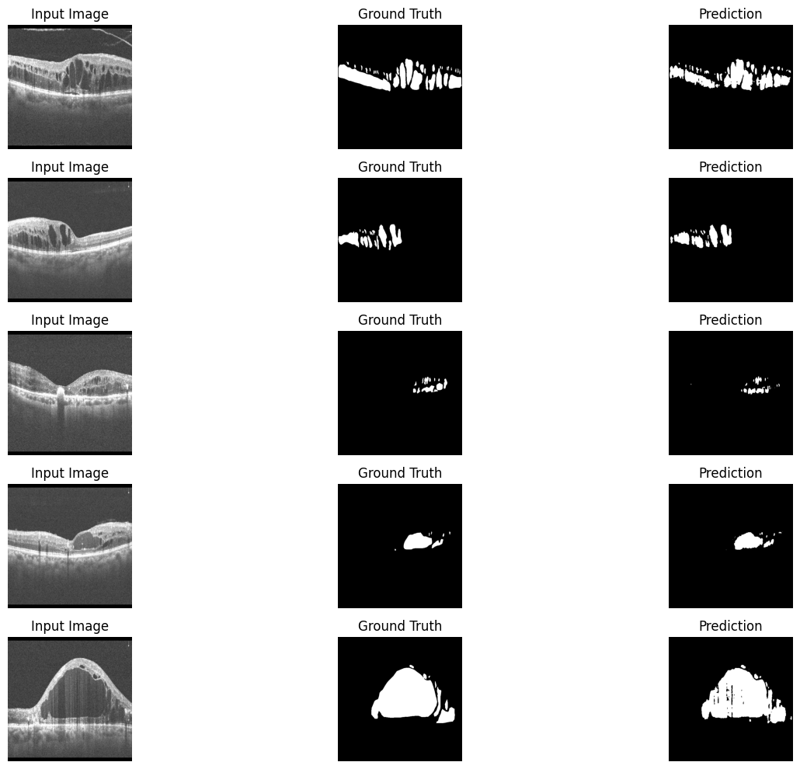

# 🧬 DME-Biomarker-Detection: Detection, Quantification, and Longitudinal Analysis of Diabetic Macular Edema Biomarkers in OCT Images

A research-driven project exploring deep learning approaches for the detection and quantification of Diabetic Macular Edema (DME) biomarkers in OCT images, aiming to support clinical decision-making and improve ophthalmic diagnostics.

---

## 1. Introduction

Diabetic Macular Edema (DME) is one of the most severe complications of diabetes and a leading cause of vision impairment worldwide. In Algeria, the prevalence of this pathology represents a major public health challenge. According to Prof. Nouri, head of department at Beni Messous Hospital, approximately 12% of adult diabetic patients suffer from diabetic retinopathy, and 42% of these patients develop DME, a severe form of diabetic retinopathy.

The management of DME is complex and costly, placing a significant burden on healthcare systems. Accurately assessing the evolution of the disease over time is essential to determine whether a patient’s treatment is effective or requires adjustment. Traditional clinical workflows rely heavily on manual interpretation of OCT images by ophthalmologists, which is time-consuming and subject to inter-observer variability.

Artificial Intelligence (AI) offers a promising solution to improve early detection, severity assessment, and monitoring of DME. By leveraging deep learning techniques for medical image analysis, AI systems can provide precise, reproducible, and quantitative evaluations of retinal biomarkers. This project proposes an end-to-end deep learning framework for the automated detection, quantification, and temporal comparison of DME-related biomarkers in OCT images, with the objective of supporting ophthalmologists in diagnosis and follow-up of patients.

---

## 2. Motivation and Impact

Monitoring disease progression is critical in chronic pathologies such as DME. Beyond detecting biomarkers in a single image, this project introduces a longitudinal analysis approach that compares OCT images acquired at different time points during a patient’s treatment.

By comparing successive OCT scans of the same patient, the system can:

* Determine whether the patient’s condition is improving, worsening, or remaining stable.
* Quantify changes in retinal biomarkers over time.
* Provide objective indicators to support therapeutic decision-making.
* Reduce subjectivity in clinical evaluation.

From both a clinical and research perspective, this project explores the integration of computer vision, medical imaging, and temporal analysis, contributing to the development of intelligent systems capable of dynamic disease monitoring rather than static diagnosis.

---

## 3. Objectives

The main objectives of this project are:

1. Develop an AI-based system for detecting DME-related biomarkers in OCT images.
2. Quantify retinal structural abnormalities associated with DME.
3. Implement a longitudinal comparison module to analyze disease progression over time.
4. Evaluate multiple deep learning architectures for detection, segmentation, and classification tasks.
5. Design a medically meaningful severity scoring function based on expert knowledge (**TODO**).
6. Provide a robust and extensible framework for future research in medical AI.

---

## 4. Proposed AI Solution

### 4.1 Overview of the Approach

The proposed solution analyzes OCT images acquired at different stages of a patient’s treatment. For each patient, the system processes multiple OCT scans and extracts quantitative information about retinal biomarkers. These outputs are then compared across time to determine the evolution of the disease.

### 4.2 Biomarkers of Interest

1. **Disorganization of Retinal Inner Layers (DRIL)** – Loss of clear boundaries between the inner retinal layers, indicating disease progression.
2. **Discontinuity of the Ellipsoid Zone and External Limiting Membrane (ELM)** – Disruptions in photoreceptor layers linked to visual impairment.
3. **Cystoid Spaces (Intraretinal Cysts)** – Dark circular regions; size, distribution, and volume indicate edema severity.
4. **Hyperreflective Foci** – Small bright spots indicating pathological changes and inflammation.

For each biomarker, specialized deep learning models are selected and optimized for detection and quantification.

---

## 5. Models & Methodology

### 5.1 Object Detection Models

Primarily for hyperreflective foci and localized abnormalities:

* YOLO (v1–v8)
* SSD (Single Shot MultiBox Detector)
* RetinaNet
* R-CNN family

### 5.2 Segmentation Models

For pixel-level segmentation of cystoid spaces and fluid regions:

* U-Net and its variants
* Other encoder–decoder architectures

### 5.3 Classification Models

For severity assessment and feature extraction:

* ResNet
* EfficientNet
* Custom CNN architectures

### 5.4 Results & Visualizations

#### Cystoid Spaces Segmentation

| Model               | Dataset      | Mean Dice       | Mean IoU        | Notes                                      |
| :------------------ | :----------- | :-------------- | :-------------- | :----------------------------------------- |
| **U-Net**           | Validation   | 0.8478          | **TODO**        | Good segmentation, minor over-segmentation |
|                     | Hospital 324 | 0.7424          | 0.6230          | Slight performance drop on external data   |
|                     | Hospital 75  | 0.6938          | 0.5864          | Limited data, more augmentation needed     |
| **U-Net++**         | 324          | 0.6220          | 0.5158          | Underfitting observed                      |
|                     | 72           | 0.6946          | 0.5899          | Comparable to baseline                     |
| **Attention U-Net** | 324          | 0.6558 ± 0.2664 | 0.5369 ± 0.2516 | High variance across images                |
|                     | 72           | 0.6400 ± 0.2819 | 0.5242 ± 0.2625 | Needs more data                            |

**Visualization:**

> Over-segmentation observed in larger cystoids; external datasets show lower performance.

#### DRIL Classification

| Dataset    | Accuracy | F1-Score | ROC-AUC  | Notes                                           |
| :--------- | :------- | :------- | :------- | :---------------------------------------------- |
| Validation | **TODO** | **TODO** | **TODO** | Weighted loss applied to handle class imbalance |
| Test       | **TODO** | **TODO** | **TODO** | Needs full testing                              |

**Visualization Placeholder:**

> Binary classification — 795 positive, 1507 negative labels; testing is pending.

#### Hyperreflective Dots Detection

| Dataset    | Dice     | MSE      | Notes                                       |
| :--------- | :------- | :------- | :------------------------------------------ |
| Validation | **TODO** | **TODO** | Small object detection challenging          |
| Test       | **TODO** | **TODO** | Noise and annotation quality affect results |

**Visualization:**

> Heatmap regression for detecting small hyperreflective dots; current model handles some but misses others due to annotation quality.

#### Severity & Quantitative Biomarker Analysis

| Biomarker            | Quantification Method | Status                              |
| :------------------- | :-------------------- | :---------------------------------- |
| Cystoids             | Surface area, count   | **TODO: formula & implementation**  |
| DRIL                 | Binary label          | **TODO: testing & scoring formula** |
| Hyperreflective Dots | Dot count, intensity  | **TODO: testing & formula**         |

**Longitudinal Visualization Placeholder:**

> Temporal comparisons of biomarker changes over multiple OCT scans; formulas for scoring and longitudinal metrics are in progress.

---

## 6. Dataset

### 6.1 Data Description

The dataset consists of **1556 annotated OCT images** collected from clinical collaborators and public sources. Expert annotations were provided by ophthalmologists. The data is split as follows:

* 70% Train
* 15% Validation
* 15% Test

**DRIL labels:** 795 positive, 1507 negative. Weighted loss is used during training to handle class imbalance.

### 6.2 Preprocessing

* Image normalization and resizing
* Noise reduction
* Data augmentation (rotation, flipping, contrast enhancement)
* Annotation formatting for deep learning models

Due to ethical and privacy considerations, parts of the dataset may not be publicly accessible. All patient data is anonymized.

---

## 7. Longitudinal Analysis: Disease Progression Monitoring

The system compares OCT images acquired at different time points to:

* Measure variations in biomarker size, shape, and intensity.
* Quantify progression or regression of retinal abnormalities.
* Generate a temporal profile of disease evolution.

**Longitudinal scoring formula:** **TODO**

---

## 8. Evaluation Metrics

Performance is evaluated using clinically relevant metrics:

* Precision, Recall, and F1-score
* Intersection over Union (IoU)
* Mean Average Precision (mAP)
* Dice Coefficient (for segmentation)
* Accuracy and ROC-AUC (for classification)
* Temporal consistency metrics for longitudinal analysis

---

## 9. Challenges and Limitations

* Limited availability of annotated medical data
* Class imbalance among biomarkers
* Variability in OCT image quality
* Generalization across different devices and populations
* Some formulas for quantification and longitudinal scoring are still under development

---

## 10. Future Work

* Integrating the fourth biomarker 
* Integration of multimodal clinical data (OCT + patient metadata)
* Deployment in real-world clinical environments
* Validation through large-scale clinical studies

---

## 11. Disclaimer

This project is intended for **research and educational purposes only**. It is not designed for clinical use or medical diagnosis yet.

---

## 12. Author

**Randa Benmaiche**
AI Student | Computer Vision & Medical Imaging
GitHub: [https://github.com/RandaBasmalaBenmaiche](https://github.com/RandaBasmalaBenmaiche)
